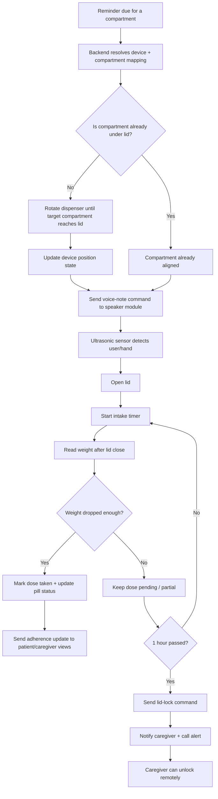

# Backend API Endpoint Map (IoT + Patient Portal + Caregiver Portal)

Generated: 2026-05-18

## Analysis scope
- Backend route inventory generated from Django resolver (`config.settings.development`).
- IoT firmware usage extracted from ESP32 source.
- Patient and caregiver portal usage extracted from frontend agents/hooks.

## Backend inventory totals
- Total resolved routes in project (including admin/static/regex artifacts): 430
- Total resolved `/api/v1/` routes: 250

## IoT device endpoints required for working firmware
These are the endpoints the ESP32 firmware actively calls for device operation.

| Method | Endpoint | Used for |
|---|---|---|
| POST | /api/v1/iot/events/ | Generic device events (`DEVICE_BOOT`, `COMMAND_ACKNOWLEDGED`, etc.) |
| POST | /api/v1/iot/heartbeat/ | Heartbeat with battery, WiFi, uptime |
| GET | /api/v1/iot/devices/{device_id}/commands/ | Poll pending commands from backend |
| POST | /api/v1/iot/events/gate-event/ | Gate open/close event tracking and lock logic |
| POST | /api/v1/iot/events/weight-reading/ | Dose verification via load-cell reading |
| POST | /api/v1/iot/events/fill-weight/ | Fill-mode medicine weight calibration |
| GET | /api/v1/iot/sync/time/ | Clock sync from backend unix timestamp |
| GET | /api/v1/iot/devices/{device_id}/dispenser/schedule/current/ | Fetch currently active dose schedule |

## Patient portal endpoints
These are backend endpoints used by patient-facing flows.

### Auth and account
| Method | Endpoint |
|---|---|
| POST | /api/v1/auth/register/ |
| POST | /api/v1/auth/login/ |
| POST | /api/v1/auth/login/otp/ |
| POST | /api/v1/auth/otp/request/ |
| POST | /api/v1/auth/google/ |
| POST | /api/v1/auth/refresh/ |
| POST | /api/v1/auth/logout/ |
| POST | /api/v1/auth/verify-email/ |
| POST | /api/v1/auth/mfa/setup/ |
| POST | /api/v1/auth/mfa/verify/ |
| POST | /api/v1/auth/mfa/backup-codes/ |
| POST | /api/v1/auth/password/change/ |
| POST | /api/v1/auth/password/reset/ |
| PUT | /api/v1/auth/password/reset/confirm/ |

### User profile and security
| Method | Endpoint |
|---|---|
| GET,PATCH | /api/v1/users/me/ |
| GET,PATCH | /api/v1/users/me/notifications/ |
| GET | /api/v1/users/me/sessions/ |
| DELETE | /api/v1/users/me/sessions/{session_id}/ |
| GET,POST | /api/v1/users/me/devices/ |
| DELETE | /api/v1/users/me/devices/{device_id}/ |

### Clinical profile and conditions
| Method | Endpoint |
|---|---|
| GET,PUT | /api/v1/patients/me/ |
| GET,POST | /api/v1/patients/me/conditions/ |
| DELETE | /api/v1/patients/me/conditions/{condition_id}/ |
| PATCH | /api/v1/patients/me/hospitalize/ |
| PATCH | /api/v1/patients/me/discharge/ |

### Caregiver link management (from patient side)
| Method | Endpoint |
|---|---|
| GET | /api/v1/patients/me/caregivers/ |
| POST | /api/v1/patients/me/caregivers/invite/ |
| DELETE | /api/v1/patients/me/caregivers/{link_id}/ |
| PATCH | /api/v1/patients/me/caregivers/{link_id}/permissions/ |
| POST | /api/v1/links/{token}/accept/ |

### Prescriptions and schedules
| Method | Endpoint |
|---|---|
| GET,POST | /api/v1/patients/me/prescriptions/ |
| GET,PUT,DELETE | /api/v1/patients/me/prescriptions/{prescription_id}/ |
| GET,POST | /api/v1/patients/me/prescriptions/{prescription_id}/schedules/ |
| PUT,DELETE | /api/v1/patients/me/prescriptions/{prescription_id}/schedules/{schedule_id}/ |

### Adherence and reminders
| Method | Endpoint |
|---|---|
| GET | /api/v1/reminders/today/ |
| GET | /api/v1/reminders/upcoming/ |
| GET | /api/v1/reminders/{reminder_id}/ |
| POST | /api/v1/reminders/{reminder_id}/log/ |
| POST | /api/v1/reminders/{reminder_id}/snooze/ |
| GET | /api/v1/adherence/summary/ |
| GET | /api/v1/adherence/timeline/ |
| GET | /api/v1/adherence/medications/ |
| GET | /api/v1/adherence/history/ |
| GET,PATCH | /api/v1/adherence/history/{log_id}/ |
| GET | /api/v1/adherence/export/ |
| POST | /api/v1/adherence/manual/ |
| GET | /api/v1/gamification/summary/ |
| GET | /api/v1/gamification/ping/ |

### Notifications and emergency
| Method | Endpoint |
|---|---|
| GET | /api/v1/notifications/ |
| PATCH | /api/v1/notifications/read-all/ |
| PATCH | /api/v1/notifications/{notification_id}/read/ |
| DELETE | /api/v1/notifications/{notification_id}/ |
| POST | /api/v1/notifications/sos/trigger/ |

### Subscription and billing (settings screens)
| Method | Endpoint |
|---|---|
| GET | /api/v1/subscriptions/current/ |
| GET | /api/v1/subscriptions/plans/ |
| POST | /api/v1/subscriptions/create-order/ |
| POST | /api/v1/subscriptions/verify-payment/ |
| POST | /api/v1/subscriptions/upgrade/ |
| POST | /api/v1/subscriptions/cancel/ |
| GET | /api/v1/subscriptions/invoices/ |
| GET | /api/v1/subscriptions/invoices/{invoice_id}/download/ |
| POST | /api/v1/subscriptions/invoices/{invoice_id}/email/ |

## Caregiver portal endpoints
These are backend endpoints used by caregiver-facing flows.

### Caregiver patient management
| Method | Endpoint |
|---|---|
| GET | /api/v1/caregivers/patients/ |
| POST | /api/v1/caregivers/patients/add/ |
| GET,PATCH | /api/v1/caregivers/patients/{patient_id}/ |
| GET | /api/v1/caregivers/patients/{patient_id}/alerts/ |
| GET,POST | /api/v1/caregivers/patients/{patient_id}/prescriptions/ |
| GET | /api/v1/caregivers/patients/{patient_id}/devices/ |
| PATCH | /api/v1/caregivers/patients/{patient_id}/devices/{device_id}/compartments/{compartment_number}/reschedule/ |

### Caregiver adherence monitoring
| Method | Endpoint |
|---|---|
| GET | /api/v1/caregivers/patients/{patient_id}/adherence/summary/ |
| GET | /api/v1/caregivers/patients/{patient_id}/adherence/timeline/ |
| GET | /api/v1/caregivers/patients/{patient_id}/adherence/medications/ |
| GET | /api/v1/caregivers/patients/{patient_id}/adherence/export/ |

### Caregiver analytics dashboard
| Method | Endpoint |
|---|---|
| GET | /api/v1/analytics/caregiver/summary/ |
| GET | /api/v1/analytics/caregiver/cohort/ |

### Caregiver chat and communication
| Method | Endpoint |
|---|---|
| GET,POST | /api/v1/communications/rooms/ |
| GET | /api/v1/communications/rooms/{room_id}/messages/ |
| POST | /api/v1/communications/rooms/{room_id}/read/ |
| POST | /api/v1/communications/rooms/{room_id}/upload/ |

### Caregiver IoT controls and monitoring
| Method | Endpoint |
|---|---|
| GET | /api/v1/iot/devices/ |
| GET,PATCH,DELETE | /api/v1/iot/devices/{device_id}/ |
| GET | /api/v1/iot/devices/{device_id}/status/ |
| GET | /api/v1/iot/devices/{device_id}/events/ |
| POST | /api/v1/iot/devices/validate-code/ |
| POST | /api/v1/iot/devices/link/ |
| PATCH | /api/v1/iot/devices/{device_id}/link-patient/ |
| DELETE | /api/v1/iot/devices/{device_id}/unlink/ |
| GET,PUT | /api/v1/iot/devices/{device_id}/compartments/ |
| GET | /api/v1/iot/devices/{device_id}/inventory/ |
| POST | /api/v1/iot/devices/{device_id}/commands/queue/ |
| POST | /api/v1/iot/devices/{device_id}/fill/start/ |
| POST | /api/v1/iot/devices/{device_id}/fill/next/ |
| POST | /api/v1/iot/devices/{device_id}/fill/end/ |
| POST | /api/v1/iot/devices/{device_id}/dispenser/setup/ |
| GET | /api/v1/iot/devices/{device_id}/dispenser/compartments/ |
| POST | /api/v1/iot/devices/{device_id}/dispenser/compartments/{compartment_num}/medicine/add/ |
| GET,DELETE | /api/v1/iot/devices/{device_id}/dispenser/compartments/{compartment_num}/medicines/ |
| GET,DELETE | /api/v1/iot/devices/{device_id}/dispenser/compartments/{compartment_num}/medicines/{medicine_id}/ |
| POST | /api/v1/iot/devices/{device_id}/dispenser/compartments/{compartment_num}/medicines/{medicine_id}/measure-weight/ |
| POST | /api/v1/iot/devices/{device_id}/dispenser/fill/complete/ |
| GET | /api/v1/iot/dose/alerts/ |
| GET | /api/v1/iot/dose/history/ |
| GET | /api/v1/iot/dose/missed/ |
| POST | /api/v1/iot/dose/caregiver-unlock/ |

## Mismatches found (frontend calls not present in backend routes)
These should be fixed in either frontend or backend to avoid runtime 404/405 errors.

| Frontend call pattern | Status |
|---|---|
| /api/v1/auth/fcm-token/ | Not present in backend `apps.identity.urls.auth` |
| /api/v1/caregivers/patients/{patient_id}/reminders/today/ | Not present in backend routes |
| /api/v1/caregivers/patients/{patient_id}/reminders/upcoming/ | Not present in backend routes |
| /api/v1/caregivers/patients/{patient_id}/gamification/summary/ | Not present in backend routes |

## Patient-side IoT workflow flowchart
This is the workflow you described for the patient side. It is a target-state flow, not fully implemented today.

## Implementation plan
### Phase 1: Backend state model
- Add a device position/state field so the backend knows which compartment is currently under the lid.
- Keep the current compartment mapping and schedule sync logic, but extend it to store `target_compartment`, `last_aligned_compartment`, and `intake_window_started_at`.
- Add a voice-note payload field to the queued device command model so the backend can tell the speaker module what to play.

### Phase 2: Patient dose-time orchestration
- When a reminder becomes due, resolve the linked device and target compartment.
- If the compartment is not under the lid, queue a rotate command first.
- Once aligned, queue a voice-note command and then an unlock/open command.
- Start a dose window timer so the backend can later decide whether the dose was taken or missed.

### Phase 3: Intake verification
- Use ultrasonic detection to detect user presence before opening the lid.
- After lid close, trigger weight reading and compare it with the expected weight for that compartment.
- If weight reduction matches the expected dose threshold, mark the dose as taken and update adherence/pill status.
- If the reduction is partial, keep the session open as partial and continue monitoring until the timeout expires.

### Phase 4: Missed-dose escalation
- If the patient does not take the dose within 1 hour, queue a lid-lock command.
- Emit caregiver notification, call alert, and missed-dose alert records.
- Expose a caregiver unlock action so the caregiver can remotely unlock the device after review.

### Phase 5: Firmware changes
- Add speaker-module support for voice-note playback commands.
- Add a rotate-to-compartment command if the device is not already under the lid.
- Add ultrasonic-triggered lid-open behavior.
- Add weight-drop reporting after the gate closes.
- Add lid-lock and caregiver-unlock command handling.

### Phase 6: Validation
- Test the happy path for one dose: rotate -> voice note -> ultrasonic detect -> lid open -> weight drop -> dose taken.
- Test the missed-dose path: no intake for 1 hour -> lock -> caregiver notified -> remote unlock.
- Test the partial-dose path to confirm the backend does not mark the dose as taken too early.

## Primary source files used in this analysis
- backend/config/urls.py
- backend/apps/iot/urls.py
- backend/apps/clinical/urls/patients.py
- backend/apps/clinical/urls/caregivers.py
- backend/apps/scheduling/urls/reminders.py
- backend/apps/scheduling/urls/adherence.py
- backend/apps/notifications/urls.py
- backend/apps/communications/urls.py
- backend/apps/identity/urls/auth.py
- backend/apps/identity/urls/users.py
- backend/apps/subscriptions/urls.py
- frontend/src/agents/caregiver.agent.js
- frontend/src/agents/adherence.agent.js
- frontend/src/agents/iot.agent.js
- frontend/src/agents/auth.agent.js
- frontend/src/hooks/useConditions.js
- frontend/src/hooks/usePatientReports.js
- iot file/config.h
- iot file/api.h
- iot file/esp32_firmware.ino
